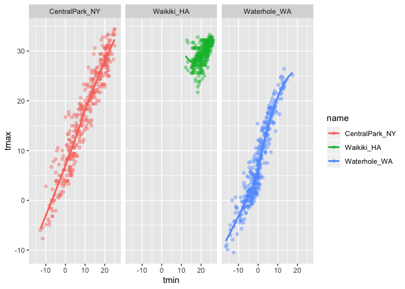
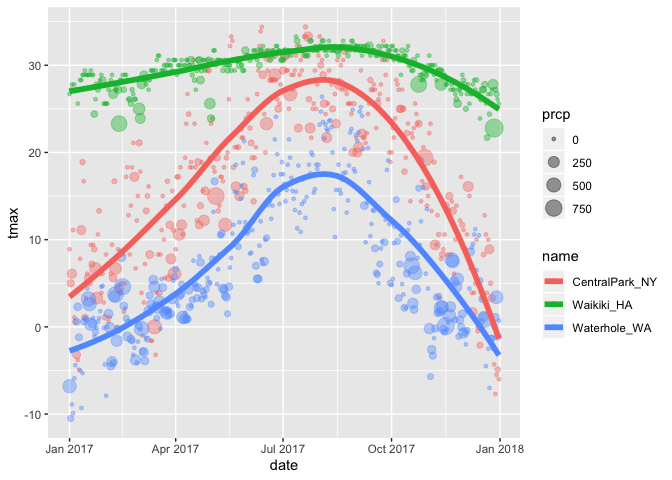

gglot 1
================

## create the weather data

``` r
weather_df = 
  rnoaa::meteo_pull_monitors(c("USW00094728", "USC00519397", "USS0023B17S"),
                      var = c("PRCP", "TMIN", "TMAX"), 
                      date_min = "2017-01-01",
                      date_max = "2017-12-31") %>%
  mutate(
    name = recode(id, USW00094728 = "CentralPark_NY", 
                      USC00519397 = "Waikiki_HA",
                      USS0023B17S = "Waterhole_WA"),
    tmin = tmin / 10,
    tmax = tmax / 10) %>%
  select(name, id, everything())
```

    ## Registered S3 method overwritten by 'crul':
    ##   method                 from
    ##   as.character.form_file httr

    ## Registered S3 method overwritten by 'hoardr':
    ##   method           from
    ##   print.cache_info httr

    ## file path:          /Users/shaoanran/Library/Caches/rnoaa/ghcnd/USW00094728.dly

    ## file last updated:  2019-10-06 15:44:42

    ## file min/max dates: 1869-01-01 / 2019-10-31

    ## file path:          /Users/shaoanran/Library/Caches/rnoaa/ghcnd/USC00519397.dly

    ## file last updated:  2019-10-06 15:45:08

    ## file min/max dates: 1965-01-01 / 2019-10-31

    ## file path:          /Users/shaoanran/Library/Caches/rnoaa/ghcnd/USS0023B17S.dly

    ## file last updated:  2019-10-06 15:45:13

    ## file min/max dates: 1999-09-01 / 2019-10-31

recode: rename the station code.

## create a gglot

``` r
ggplot(weather_df,aes(x = tmin, y =tmax)) + geom_point()
```

    ## Warning: Removed 15 rows containing missing values (geom_point).

<!-- -->

## alternate way of making this plot

start with a data, then do others, such as ggplot, filter…..

``` r
weather_df %>% 
  ggplot(aes(x =tmin, y = tmax)) + geom_point()
```

    ## Warning: Removed 15 rows containing missing values (geom_point).

<!-- -->

saving initial plots, mostly don’t do this

``` r
weather_df %>% 
  filter(name == "CentralPark_NY")
```

    ## # A tibble: 365 x 6
    ##    name           id          date        prcp  tmax  tmin
    ##    <chr>          <chr>       <date>     <dbl> <dbl> <dbl>
    ##  1 CentralPark_NY USW00094728 2017-01-01     0   8.9   4.4
    ##  2 CentralPark_NY USW00094728 2017-01-02    53   5     2.8
    ##  3 CentralPark_NY USW00094728 2017-01-03   147   6.1   3.9
    ##  4 CentralPark_NY USW00094728 2017-01-04     0  11.1   1.1
    ##  5 CentralPark_NY USW00094728 2017-01-05     0   1.1  -2.7
    ##  6 CentralPark_NY USW00094728 2017-01-06    13   0.6  -3.8
    ##  7 CentralPark_NY USW00094728 2017-01-07    81  -3.2  -6.6
    ##  8 CentralPark_NY USW00094728 2017-01-08     0  -3.8  -8.8
    ##  9 CentralPark_NY USW00094728 2017-01-09     0  -4.9  -9.9
    ## 10 CentralPark_NY USW00094728 2017-01-10     0   7.8  -6  
    ## # … with 355 more rows

scatter plot

``` r
scatterplot = 
  weather_df %>% 
  ggplot(aes(x = tmin, y = tmax)) + 
  geom_point()
scatterplot
```

    ## Warning: Removed 15 rows containing missing values (geom_point).

<!-- -->

adding color

``` r
weather_df %>% 
  ggplot(aes(x = tmin, y = tmax)) + 
  geom_point(aes(color = name), alpha = 0.4 )
```

    ## Warning: Removed 15 rows containing missing values (geom_point).

<!-- --> alpha: degree of
transparent (0-1).

why do `aes` positions matter?

``` r
weather_df %>% 
  ggplot(aes(x = tmin, y = tmax)) + 
  geom_point(aes(color = name), alpha = 0.4 ) + 
  geom_smooth()
```

    ## `geom_smooth()` using method = 'gam' and formula 'y ~ s(x, bs = "cs")'

    ## Warning: Removed 15 rows containing non-finite values (stat_smooth).

    ## Warning: Removed 15 rows containing missing values (geom_point).

<!-- -->

``` r
 ##   geom_smooth(se = false) is used to turn off the line 
 ##  ggplot(aes(x = tmin, y = tmax, color = name)), if i put the color under gglot, both geom_point and geom_smooth will have the same color.(the color will be applied everywhere.)
```

the central line is used to describe the trend.

facet\! separate into three figures\!\!\!\!

``` r
weather_df %>% 
  ggplot(aes(x = tmin, y = tmax, color = name)) + 
  geom_point(aes(color = name), alpha = 0.4 ) + 
  geom_smooth(se = FALSE) +
  facet_grid(~name)
```

    ## `geom_smooth()` using method = 'loess' and formula 'y ~ x'

    ## Warning: Removed 15 rows containing non-finite values (stat_smooth).

    ## Warning: Removed 15 rows containing missing values (geom_point).

<!-- -->

``` r
  ## separate into three figures!!!!
```

temperature over the day of year in three locations, with precipitation.

``` r
weather_df %>% 
  ggplot(aes(x = date, y = tmax, color = name)) +
  geom_point(aes(size = prcp), alpha = 0.4) +
  ## we can ignore this step if we wanna have only geom_smooth
  geom_smooth(se = FALSE, size = 2)
```

    ## `geom_smooth()` using method = 'loess' and formula 'y ~ x'

    ## Warning: Removed 3 rows containing non-finite values (stat_smooth).

    ## Warning: Removed 3 rows containing missing values (geom_point).

<!-- -->

2d density

``` r
# install. packages("hexbin") for geom_hex 
weather_df %>% 
  ggplot(aes(x = tmin, y = tmax, color = name)) + 
  geom_bin2d() +
  ## same things, but little squares. 
  facet_grid(~name)
```

    ## Warning: Removed 15 rows containing non-finite values (stat_bin2d).

<!-- -->

## more kinds of plots\!\!

``` r
weather_df %>% 
  ggplot(aes(x = tmax, fill = name)) + 
  geom_histogram() + 
  facet_grid(~name)
```

    ## `stat_bin()` using `bins = 30`. Pick better value with `binwidth`.

    ## Warning: Removed 3 rows containing non-finite values (stat_bin).

<!-- -->

density plots

``` r
weather_df %>% 
  ggplot(aes(x = tmax, color = name, fill = name)) + 
  geom_density(alpha = 0.3)
```

    ## Warning: Removed 3 rows containing non-finite values (stat_density).

<!-- -->

``` r
weather_df %>% 
  ggplot(aes(x = name, y = tmax)) + 
  geom_boxplot()
```

    ## Warning: Removed 3 rows containing non-finite values (stat_boxplot).

<!-- -->

``` r
weather_df %>% 
  ggplot(aes(x = name, y = tmax)) + 
  geom_violin(fill = "yellow")
```

    ## Warning: Removed 3 rows containing non-finite values (stat_ydensity).

<!-- -->

ridge plots\!\!\!

``` r
weather_df %>% 
  ggplot(aes(x = tmax, y = name)) + 
  ggridges::geom_density_ridges()
```

    ## Picking joint bandwidth of 1.84

    ## Warning: Removed 3 rows containing non-finite values (stat_density_ridges).

<!-- -->
